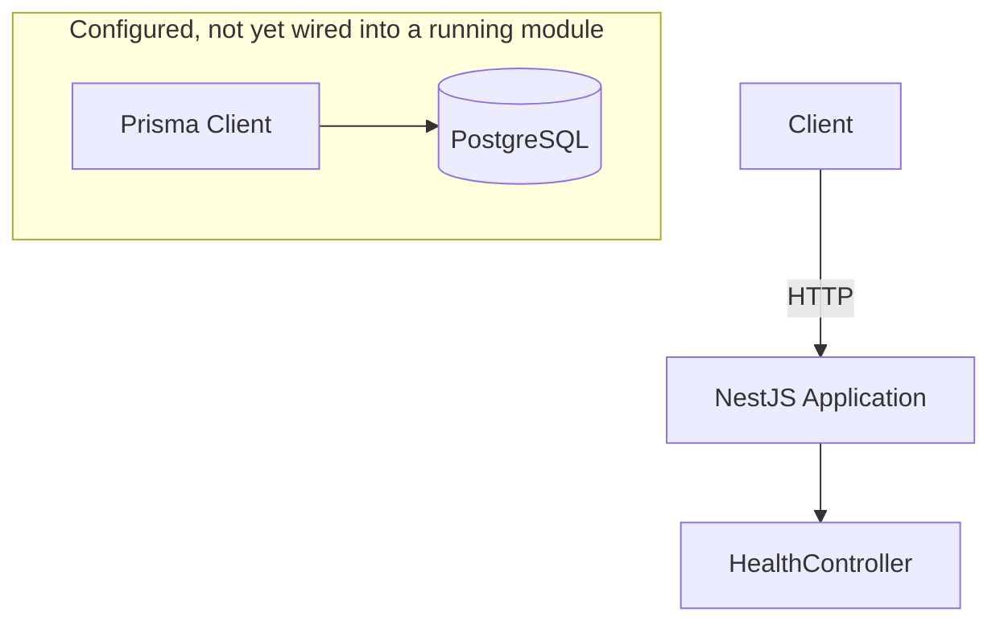
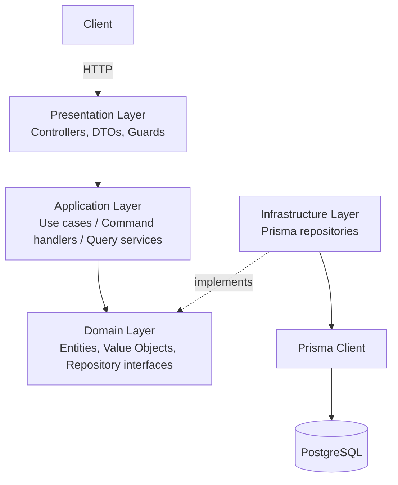
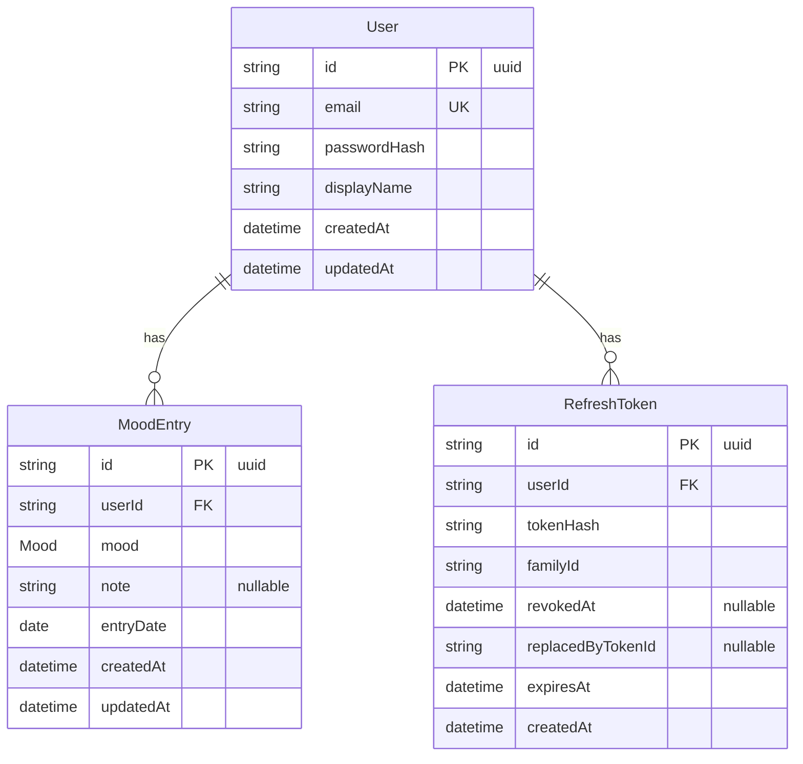

# Mood Diary — Backend

**Status:** 🚧 In Development

[](https://github.com/nganbuithii/mood-diary-backend/actions/workflows/ci.yml)

**Live API docs (Swagger):** https://mood-diary-backend-vdki.onrender.com/docs

A backend API for a personal mood-journaling application, built with NestJS, PostgreSQL, and Prisma. This repository is a learning project: it is being built incrementally, with each phase focused on a specific set of backend engineering skills rather than shipping features as fast as possible.

## Table of Contents

- [Overview](#overview)
- [Tech Stack](#tech-stack)
- [System Architecture](#system-architecture)
- [Source Code Architecture](#source-code-architecture)
- [Database Design](#database-design)
- [Database Principles](#database-principles)
- [Feature Roadmap](#feature-roadmap)
- [Phase 7 — Scalability & System Design (Optional)](#phase-7--scalability--system-design-optional)
- [Phase 8 — Microservices Exploration (Optional)](#phase-8--microservices-exploration-optional)
- [Local Development](#local-development)
- [API Documentation](#api-documentation)
- [Engineering Decisions](#engineering-decisions)
- [Project Status](#project-status)

## Overview

Mood Diary is intended to let a user:

- Authenticate (register / log in)
- Log a mood entry once per day, optionally with a note
- Browse their mood history
- Track emotional trends over time

This is not meant to be a plain CRUD exercise. The project exists to practice, in a real (if small) codebase:

- Backend architecture and API design
- Relational database design (SQL / PostgreSQL)
- Transactions and data-integrity guarantees
- Authentication & authorization
- Application security
- Automated testing (unit / integration / e2e)
- Docker-based development environments
- Caching and background jobs
- Observability
- CI/CD
- System design trade-offs, including when *not* to reach for a given pattern

**Development strategy:**

```
Monolith → Modular Monolith → Production-ready architecture → Microservices (only with a justified use case)
```

Clean Architecture, Domain-Driven Design, and CQRS concepts are applied **selectively** — only in modules with real business rules worth isolating and unit-testing — rather than uniformly across every module. The goal is to practice separation of concerns and maintainability without over-engineering simple CRUD operations.

## Tech Stack

Only technology actually present in the codebase is marked **Implemented**. Everything else is **Planned** for a later phase.

| Category | Technology | Status |
|---|---|---|
| Backend | Node.js 20 | Implemented |
| Backend | NestJS 11 | Implemented |
| Backend | TypeScript 5 (strict mode) | Implemented |
| Database | PostgreSQL 16 | Implemented |
| Database | Prisma ORM 6 | Implemented |
| API Docs | Swagger / OpenAPI (`@nestjs/swagger`) | Implemented |
| Validation | Zod (environment config) | Implemented |
| Validation | class-validator / class-transformer (DTOs) | In Progress — dependency installed and global `ValidationPipe` wired up; no DTOs use it yet |
| Architecture | Modular Monolith (NestJS modules) | In Progress — module structure exists, only one trivial module (`health`) so far |
| Architecture | Clean Architecture (per module, selective) | Planned |
| Architecture | Domain-Driven Design concepts | Planned |
| Architecture | CQRS (manual Command/Handler, where justified) | Planned |
| Infrastructure | Docker | Implemented |
| Infrastructure | Docker Compose (Postgres, backend, Adminer) | Implemented |
| Infrastructure | Redis (caching / queues) | Planned |
| Testing | Jest | Implemented |
| Testing | E2E testing (Jest + Supertest) | Implemented (minimal: one test) |
| Testing | Integration testing (real DB) | Planned |
| CI/CD | GitHub Actions (lint, build, test, migration check) | Implemented |
| CI/CD | Production (multi-stage) Docker build | Planned |
| CI/CD | Automated deployment | Planned |
| Dev Tools | pnpm | Implemented |
| Dev Tools | ESLint (flat config) | Implemented |
| Dev Tools | Prettier | Implemented |

## System Architecture

**Current implementation.** The application is a single NestJS process. There is no domain/application layering yet — `HealthController` is the only route, and it does not touch the database. Prisma is fully configured (schema + migration) but is not yet wired into any running code (no `PrismaService` exists in `src/` today).



**Target architecture.** Once feature modules (auth, mood entries, …) are added, the intended request flow is:



This layering will be applied per module, based on how much real business logic that module has (see [Source Code Architecture](#source-code-architecture) and [Engineering Decisions](#engineering-decisions)) — not applied uniformly to every module regardless of complexity.

## Source Code Architecture

**Current structure** (`src/`), as it exists today:

```
src/
├── config/
│   └── env.schema.ts        # Zod schema for process.env, validated at bootstrap
├── health/
│   ├── health.controller.ts
│   ├── health.controller.spec.ts
│   └── health.module.ts
├── app.module.ts
└── main.ts                  # Nest bootstrap, global ValidationPipe, Swagger setup
```

There is no `modules/` directory and no domain/application/infrastructure split yet — the codebase is intentionally still flat, matching its current scope (one health-check endpoint).

**Target architecture (planned, per module):**

```
src/modules/<module-name>/
├── domain/           # Entities, Value Objects, domain rules, repository interfaces (ports)
├── application/      # Use cases, Command/Query handlers, DTOs
├── infrastructure/   # Prisma repository implementations, external service adapters
└── presentation/     # Controllers, request/response DTOs
```

Dependency direction:

```
Presentation → Application → Domain ← Infrastructure
```

`Domain` and `Application` are intended to stay free of `@prisma/client` and NestJS-specific decorators, so business logic can be unit-tested with in-memory fakes instead of a real database. `Infrastructure` implements the repository interfaces that `Domain`/`Application` depend on. This target layering is documented in more detail in [`docs/architecture.md`](docs/architecture.md); note that document's example schema (`DiaryEntry`/`Tag`) and its mention of Redis in Phase 0 predate the current `MoodEntry`-based schema and this README — this README reflects the current, superseding decisions.

Not every module will get the full four-layer treatment — see [Engineering Decisions](#engineering-decisions) for when a plain service class is preferred instead.

## Database Design

The schema currently has three tables, defined in [`prisma/schema.prisma`](prisma/schema.prisma), applied via one migration (`prisma/migrations/20260914082112_init_user_mood_entry`).



`Mood` is a Postgres enum: `VERY_SAD | SAD | NEUTRAL | HAPPY | VERY_HAPPY`. Using an enum instead of a free-form string or a raw integer lets the database reject invalid values outright, while keeping values self-explanatory.

**Keys and constraints**

| Aspect | Detail | Why |
|---|---|---|
| Primary keys | `String` UUID v4 (`@default(uuid())`) on every table | Safe to expose externally (no sequential-ID enumeration); works without a round-trip to the DB to get an ID |
| Foreign keys | `MoodEntry.userId` and `RefreshToken.userId` → `User.id` | Standard 1-to-many ownership |
| Cascade | `onDelete: Cascade` on both foreign keys | Deleting a `User` removes their mood entries and refresh tokens — no orphaned rows, no manual cleanup job needed |
| Unique | `User.email` | Prevents duplicate accounts at the database level, even under concurrent registration requests |
| Unique (composite) | `MoodEntry(userId, entryDate)` | **Business rule: at most one mood entry per user per day**, enforced by the database itself — not only in application code (see below) |
| Index | `RefreshToken(userId)`, `RefreshToken(familyId)` | Refresh-token lookups by owner, and by token family for reuse-detection/mass revocation |
| Nullable fields | `MoodEntry.note`; `RefreshToken.revokedAt`, `RefreshToken.replacedByTokenId` | A mood entry doesn't require a note; a refresh token is only revoked/replaced once it is rotated out |

**Why `(userId, entryDate)` is a database constraint, not just an application check:** application-level checks (e.g. "query for today's entry before inserting") are vulnerable to race conditions — two concurrent requests can both pass the check before either commits. The composite unique constraint makes Postgres reject the second insert outright, so the "one entry per day" rule holds even under concurrent writes or a bug in application code. `entryDate` is stored as a Postgres `DATE` (not `TIMESTAMP`) specifically so the uniqueness check is unaffected by time-of-day or timezone.

**`RefreshToken` — current status:** the table is modeled in the schema (`tokenHash`, `familyId`, `revokedAt`, `replacedByTokenId`, `expiresAt`) to support refresh-token rotation with reuse detection: `familyId` groups every token descended from one login, so if a *revoked* token is ever presented again, the whole family can be revoked immediately (a strong signal of token theft). **No code reads or writes this table yet** — the actual auth logic is Planned for Phase 1.

## Database Principles

These are the principles this project is being built around — they describe intent and are cited against the roadmap below, not a claim that every principle is already fully realized:

- Database constraints should protect data integrity; application-level validation alone is not sufficient (already applied: `User.email` unique, `MoodEntry(userId, entryDate)` unique).
- Use transactions for operations that must succeed or fail atomically (not yet needed — no multi-table write exists yet; will apply from Phase 2 onward, e.g. creating an entry alongside related records).
- Add indexes based on actual query patterns; avoid indexes that don't serve a real query.
- Prevent N+1 queries once relational reads exist (`include`/`select` review, or a dedicated query layer for read-heavy endpoints).
- Use pagination for any endpoint returning a growing dataset (mood history, once implemented).
- Use `EXPLAIN` / `EXPLAIN ANALYZE` when optimizing a query, instead of guessing at indexes.

## Feature Roadmap

### Phase 0 — Foundation — **Complete**

- [x] NestJS project setup
- [x] TypeScript (strict mode)
- [x] Environment variable validation (Zod)
- [x] PostgreSQL (via Docker)
- [x] Prisma schema + client
- [x] Docker / Docker Compose
- [x] Health check endpoint (`GET /health`, liveness only)
- [x] Initial database schema (`User`, `MoodEntry`, `RefreshToken`)
- [x] Migration setup (first migration applied)
- [x] ESLint / Prettier
- [x] Basic test setup (Jest unit + e2e config)
- [x] Swagger / OpenAPI docs mounted at `/docs`

### Phase 1 — Authentication & User — Planned

- [ ] User registration
- [ ] Login
- [ ] Password hashing
- [ ] JWT access token
- [ ] Refresh token issuance
- [ ] Refresh token rotation
- [ ] Logout
- [ ] Token revocation
- [ ] Authentication guard
- [ ] Current user endpoint
- [ ] Input validation (DTOs)
- [ ] Duplicate email handling

Security topics to cover in this phase: password hashing, never storing raw refresh tokens (only `tokenHash`), token expiration, refresh-token reuse detection via `familyId`, and rate limiting on auth endpoints.

> The `User` and `RefreshToken` tables already exist (see [Database Design](#database-design)) — this phase is about the application logic on top of that schema, which does not exist yet.

### Phase 2 — Mood Diary Core — Planned

- [ ] Create today's mood entry
- [ ] Update today's mood entry
- [ ] Get today's mood entry
- [ ] Mood history endpoint
- [ ] Pagination
- [ ] Filter by date range
- [ ] Delete a mood entry
- [ ] Ownership validation (a user can only see/modify their own entries)

`(userId, entryDate)` uniqueness — enforcing "one mood per user per day" — is already guaranteed at the database level; this phase adds the API surface on top of it.

Mood values: `VERY_SAD`, `SAD`, `NEUTRAL`, `HAPPY`, `VERY_HAPPY`.

### Phase 3 — Database & Backend Deep Dive — Planned

A learning-focused phase, not a feature phase: the goal is to deliberately practice database and backend fundamentals once there is real read/write traffic to reason about —

- Transactions and isolation levels
- Race conditions and how to prevent them
- Composite unique constraints (in practice, beyond the one already in place)
- Index design
- Query optimization with `EXPLAIN` / `EXPLAIN ANALYZE`
- Pagination strategies — offset vs. cursor
- The N+1 query problem
- Consistent error handling
- Idempotency, where it matters (e.g. retried writes)

Each topic above will be documented as a short, concrete note (problem → query/SQL → fix → result, not a theory writeup) under `docs/learning-notes/` as it's worked through — not written in advance.

### Phase 4 — Analytics — Planned

- [ ] Mood statistics
- [ ] Weekly summary
- [ ] Monthly summary
- [ ] Mood distribution
- [ ] Mood streak
- [ ] Average mood score
- [ ] Most common mood

This phase is also the intended place to practice SQL aggregation directly (`GROUP BY`, `COUNT`, `AVG`, date bucketing) rather than only via the ORM's query builder.

### Phase 5 — Production Readiness — Planned

- [ ] Structured logging
- [ ] Request ID / correlation ID
- [ ] Global exception handling
- [ ] Rate limiting
- [ ] CORS configuration
- [ ] Helmet / security headers
- [ ] Environment configuration hardening
- [ ] Graceful shutdown
- [ ] Readiness check (dependency health, not just liveness)
- [x] API documentation with Swagger/OpenAPI — already implemented in Phase 0

Testing: unit tests (started), integration tests against a real database (planned), e2e tests (started, minimal), dedicated database integration tests (planned).

### Phase 6 — CI/CD & Deployment — In Progress

- [ ] Production Dockerfile (multi-stage build) — current `Dockerfile` is development-only (`pnpm start:dev`, bind-mounted source)
- [x] GitHub Actions CI — lint, build, unit tests, e2e tests, and `prisma migrate deploy` against an ephemeral Postgres service, on every push/PR to `main`
- [x] Prisma migration strategy for CI (`migrate deploy` against a clean database, to catch broken migrations before merge)
- [ ] Deployment pipeline
- [ ] Environment / secrets management for a real deployment target

Cloud deployment is not yet planned to a specific provider.

## Phase 7 — Scalability & System Design (Optional)

These are **not required by the current application** and are not planned until the monolith above is stable and there is a concrete reason to reach for them — they are listed here as a learning target, not a commitment:

- Redis caching
- Background jobs / queues
- Event-driven processing
- A notification service
- Horizontal scaling
- Database connection pooling
- Read/write scaling concepts
- Observability, metrics, distributed tracing

On Redis specifically: it helps once there's a read-heavy, expensive-to-compute, and relatively slow-changing value (e.g. a precomputed analytics summary) being requested often enough that recomputing it on every request is wasteful. It does *not* help — and adds real operational cost (another service to run, cache-invalidation bugs) — for data that is cheap to query directly or changes on nearly every request, which describes everything in this project today.

## Phase 8 — Microservices Exploration (Optional)

This project should **not** move to microservices for its own sake. A split is only worth making once there is an identified bounded context with its own scaling profile or team-ownership boundary — neither of which applies to a solo learning project yet.

If explored later, purely as a learning exercise, candidates would be services that are naturally decoupled from the core read/write path — e.g. a notification service or an analytics service — reading from the core service's data asynchronously rather than serving its live request path.

Topics to explore in that exercise: synchronous vs. asynchronous communication, message brokers, eventual consistency, distributed transactions (sagas), idempotent consumers, retry strategies and dead-letter queues, and observability across service boundaries.

## Local Development

**Prerequisites:** Docker Desktop (running). Node.js 20+ and pnpm are only needed if you want to run commands outside Docker.

```bash
# 1. Create your local environment file
cp .env.example .env

# 2. Start Postgres, the backend (hot-reload), and Adminer
docker compose up -d

# 3. Check container status
docker compose ps

# 4. Follow backend logs
docker compose logs -f backend

# 5. Generate the Prisma client / apply migrations (inside the backend container)
docker compose exec backend pnpm exec prisma generate
docker compose exec backend pnpm exec prisma migrate dev

# 6. Run tests
docker compose exec backend pnpm test
docker compose exec backend pnpm test:e2e

# 7. Stop everything
docker compose down
```

Environment variables actually read by the application (see [`src/config/env.schema.ts`](src/config/env.schema.ts)): `NODE_ENV`, `PORT`, `DATABASE_URL`. Copy [`.env.example`](.env.example) to `.env` and adjust values there — do not commit real secrets to `.env`.

**Once running:**

| Service | URL |
|---|---|
| API | http://localhost:3001 |
| Swagger UI | http://localhost:3001/docs |
| Adminer (DB GUI) | http://localhost:8080 |
| PostgreSQL (for DBeaver / any SQL client) | `localhost:5432` |

For a direct SQL client (DBeaver, TablePlus, etc.), connect to `localhost:5432` using the Postgres credentials from your `.env`.

## API Documentation

**Implemented:**

| Method | Endpoint | Description | Auth | Status |
|---|---|---|---|---|
| GET | `/health` | Liveness check — confirms the process is up | No | Implemented |

Interactive, always-current API documentation (generated from the running application) is available at `/docs` once the backend is up — locally at http://localhost:3001/docs, or on the deployed instance at https://mood-diary-backend-vdki.onrender.com/docs.

**Planned** (will be documented here as each phase lands — see [Feature Roadmap](#feature-roadmap)):

| Method | Endpoint | Description | Auth | Phase |
|---|---|---|---|---|
| POST | `/auth/register` | Register a new user | No | Phase 1 |
| POST | `/auth/login` | Log in, issue access + refresh tokens | No | Phase 1 |
| POST | `/auth/refresh` | Rotate a refresh token | Refresh token | Phase 1 |
| POST | `/auth/logout` | Revoke the current token | Yes | Phase 1 |
| GET | `/me` | Current authenticated user | Yes | Phase 1 |
| POST | `/mood-entries` | Create today's mood entry | Yes | Phase 2 |
| GET | `/mood-entries` | List mood history (paginated) | Yes | Phase 2 |
| PATCH | `/mood-entries/:id` | Update a mood entry | Yes | Phase 2 |
| DELETE | `/mood-entries/:id` | Delete a mood entry | Yes | Phase 2 |
| GET | `/analytics/summary` | Mood statistics / trends | Yes | Phase 4 |

## Engineering Decisions

**Why PostgreSQL.** Relational integrity and real constraints (unique, foreign key, `NOT NULL`) map directly to this project's business rules (e.g. one mood entry per day) — enforced by the database, not only by application code.

**Why Prisma.** Provides type-safe database access and a migration workflow, while still allowing raw SQL when database-level optimization is required (see [Phase 3](#phase-3--database--backend-deep-dive--planned)). Pinned to the 6.x line for now — 7.x changes how the datasource is configured (`prisma.config.ts` + driver adapters instead of `datasource.url` in `schema.prisma`), which is a large enough workflow change to revisit deliberately later rather than adopt mid-project.

**Why NestJS.** Provides a structured module system and a dependency-injection container that fits the project's gradual transition toward a modular monolith — modules can be composed independently, and DI makes it straightforward to swap an implementation behind an interface (relevant once the target layering in [Source Code Architecture](#source-code-architecture) is in place). Pinned to the 11.x line for now for compatibility with the current Jest/CommonJS test setup.

**Why Docker / Docker Compose.** A reproducible local environment (Postgres version, credentials, networking) that matches how the app would run in a container elsewhere, instead of relying on a locally-installed Postgres that can drift between machines.

**Why Modular Monolith first.** A single deployable is far easier to reason about, debug, and refactor while the domain itself is still being learned and shaped. Splitting into services before there's a stable, well-understood boundary just adds distributed-systems complexity (network calls, partial failure, eventual consistency) without a corresponding benefit.

**Why Clean Architecture is applied selectively, not uniformly.** A module with real invariants worth isolating and unit-testing (e.g. future refresh-token rotation logic) benefits from separating domain rules from Prisma/NestJS. A module that is plain CRUD with no business rule doesn't — adding four layers to it would be boilerplate, not architecture.

**Why database constraints for business invariants.** Application-level checks can be bypassed by a bug, a missed code path, or a race condition between two concurrent requests. A database constraint is enforced regardless of which code path (or how many concurrent requests) tries to violate it — see `MoodEntry(userId, entryDate)` in [Database Design](#database-design) for the concrete example already in place.

**Why microservices are postponed.** There is no identified scaling bottleneck or team-ownership boundary yet that a service split would solve — splitting now would trade simplicity for distributed-systems complexity without a justified use case (see [Phase 8](#phase-8--microservices-exploration-optional)).

## Project Status

**Status:** 🚧 In Development — foundation only; no business features (auth, mood entries, analytics) are implemented yet.

- [x] Phase 0 — Foundation
- [ ] Phase 1 — Authentication & User
- [ ] Phase 2 — Mood Diary Core
- [ ] Phase 3 — Database & Backend Deep Dive
- [ ] Phase 4 — Analytics
- [ ] Phase 5 — Production Readiness
- [ ] Phase 6 — CI/CD & Deployment *(CI implemented; production build and deployment not yet)*
- [ ] Phase 7 — Scalability & System Design *(optional)*
- [ ] Phase 8 — Microservices Exploration *(optional)*
